<h1>Как защитить Автоматизированные Системы Управления?</h1>
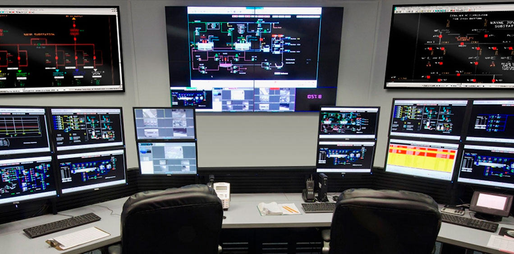

<big><u>АСУ ТП</u></big> - Автоматизированные Системы Управления Технологическими Процессами На сегодняшний день является одной из самых важных составляющих безопасности любой промышленной, производственной или иной деятельности человека. В большинстве случаев человек-оператор осуществляет все процессы, происходящие на производстве (управление оборудованием, контроль технологических процессов и т.д.) используя различные приборы и системы, работающие на базе электроники.
<u>Автоматизированные системы управления для предприятий различных отраслей промышленности</u> – нефтегазовой, металлургической, горнодобывающей, строительной – это, например, <b>АСУ ТП, ЕАСУ, АСУ ДЭС, АСУ ЦТП</b>, автоматизированные системы управления и безопасности, комплексные системы контроля и диагностики, системы управления электроснабжением, системы диспетчерского управления и сбора данных, системы автоматизации и диспетчеризации и др.
Промышленная автоматизация дело очень серьезное и уязвимое. Чем более сложным является структура и функционал продутка, тем большее количество уязвимостей есть в этой системе.

<h2>Промышленная защищенность</h2>

Современный мир в значительной степени зависит от средств автоматизации производственных процессов АСУ ТП (ICS). Атомные и гидроэлектростанции, нефте- и газопроводы, национальные сети распределения электроэнергии, транспортные системы национального и мирового уровня функционируют на основе компьютерных технологий. И от защищенности систем управления подобными системами зависит не только прибыль компаний, но и национальная безопасность.
Интерес к промышленным системам защищенности возник не так давно, после серии инцидиентов со
специализированными компьютерными вирусами, такими как Flame и Stuxnet. Тогда выяснилось, что спецслужбы
иностранных государств, конкурирующие корпорации или кибертеррористы могут использовать в своих целях недостаточное
внимание к инфомрационной безопасности систем АСУ ТП и их компонентов (SCADA/PLC).
За последние годы кибератаки на промышленные предприятия вышли на новый уровень. Произошло несколько
крупных инцидентов в системах масштаба целых городов и даже стран:
<ul>
<li>Атаки на энергетические объекты Венесуэлы: Министр связи и информации Венесуэлы Хорхе Родригес сообщил, каким образом была атакована энергетическая система страны. По его словам, кибератаке подверглась автоматизированная система управления гидроэлектростанции «Эль-Гури».</li>
<li>Атака шифровальщика на компанию City Power: 25 июля 2019 года, от атаки пока неназванного шифровальщика пострадала компания City Power, являющаяся одним из крупнейших поставщиков электроэнергии для южноафриканского мегаполиса Йоханнесбурга. В итоге жители крупнейшего города в Южной Африке массово жалуются на отключения электроэнергии.</li>
</ul
 

 <h2>Защита АСУ ТП: Теория</h2>
 <h3 align="center">Законодательство</h3>
 
Федеральный закон от 26 июля 2017 г. №187-ФЗ "О безопасности критической информационной инфраструктуры
 Российской Федерации"
 <ul>
 <li>непрерывность и комплексность обеспечения безопаности, приоритет предотвращения компьютерных атак</li>
 <li>плановые и внеплановые проверки объектов критической информационной инфраструктуры</li>
 <li>категорирование этих объектов в зависимости от их социальной, политической, экономической, экологической,
 значимости и важности для обороны, безопаности государства и правопорядка</li>
 </ul>
 

 
Глава 28 УК РФ, ст. 274.1: ответственность до 10 лет лишения свободы за неправомерное воздействие на критическую
 информационную инфраструктуру
 <ul>
<li> нарушение правил эксплуатации средств хранения, обработки или передачи охраняемой компьютерной информации,
содержащейся в критической информационной инфраструктуре</li>
<li> создание, распространение и (или) использование компьютерных программ либо иной компьютерной информации,
заведомо предназначенных для указанной цели</li>
<li> неправомерный доступ к охраняемой компьютерной информации, содержащейся в критической информационной
Инфраструктуре</li>
 </ul>
 

 <h3 align="center">Угрозы информации в АСУ ТП: Заблуждения и факты</h3>
 <table>
 <tr>
<th>ЗАБЛУЖДЕНИЯ</th>
<th>ФАКТЫ</th>
</tr>
<tr>
<td>АСУ ТП не интересна 
для злоумышленников</td>
<td>
<ul>
<li>зафиксированны сотни кибератак на АСУ ТП (статистика -- далее)</li>
<li>атаки могут совершаться не только хакерами-одиночками</li>
<li>число разработчиков АСУ ТП невелико, и, взломав систему на одном предприятии, 
злоумышленник может атаковать системы данного разработчика, применяемые в 
других компаниях</li>
</ul>
</td>
</tr>
<td>Достаточно защиты 
внешнего периметра АСУ ТП 
на логическом и физических уровнях 
(пропускной и внутриобъектовый режим, 
межсетевое экранирование )</td>
<td>
<ul>
<li>системам защиты внешнего периметра тоже могут быть присущи уязвимости</li>
<li>даже один зараженный USB-накопитель, подключенный к компьютеру внутри 
периметра, может привести к распространению вируса по всей сети</li>
</ul>
</td>
<tr>
<td>
АСУ ТП безопасна, потому что 
взломщик никогда не поймет,  
как она работает
</td>
<td>
<ul>
<li>реализация большинства популярных атак на АСУ ТП не требует понимая 
конкретных технологических процессов</li>
<li>при использовании TCP/IP злоумышленник может одним HTTP-запросом 
изменить цикл работы логических контроллеров</li>
</ul>
</td>
</tr>
<tr>
<td>
На АРМ операторов АСУ ТП 
достаточно наличие в исходном 
виде стандартных инженерных паролей
</td>
<td>
<ul>
<li>стандартные пароли уже давно известны</li>
<li>пароль можно подсмотреть, подобрать, похитить, выведать, добровольно 
передать другому человеку (в том числе злоумышленнику)</li>
</ul>
</td>
</tr>
 </table>
<h3 align="center">Почему необходима защита информации в АСУ ТП</h3>
 Ландшафт угроз: <ul>
 <li>100% Словарные пароли и устаревшее ПО с известными уязвимостями 
 были выявлены в сетях каждой промышленной компании </li>
 <li>67% Векторов атак с целью проникновения в сеть АСУ ТП характеризуется низким уровнем сложности</li>
  <li>64% В 64% случаев недостатки и ошибки в фильтрации и сегментации сетей АСУ ТП 
  были внесены администраторами предприятий</li>
   <li>61% Выявленных уязвимостей в компонентах АСУ ТП относятся к критической и высокой степени риска</li>
   <li>175 тысяч компонентов АСУ ТП доступно онлайн в Интернет </li>
   <li>73% Промышленных компаний недостаточно защищены от внешних кибератак</li>
   <li>82% Промышленных организаций не готовы противостоять внутреннему нарушителю</li>

 </ul>
<h2>Защита АСУ ТП: Практический подход</h2>

Для улучшения мероприятий, направленных на обеспечение безопасности сети АСУ ТП, лидеры рынка в сфере информационной безопасности предлагают свои решения. Одним из таких решений и является продукт PT ISIM, от компании Positive Technologies.

Для улучшения мероприятий, направленных на обеспечение безопасности сети АСУ ТП, лидеры рынка в сфере информационной безопасности предлагают свои решения. Одним из таких <a src="https://tssolution.ru/katalog/positive-technologies/isim">решений</a> и является продукт PT ISIM, от компании Positive Technologies.

<h2>Обзор PT ISIM</h2>
<h3>Информация о продукте</h3>

PT ISIM — программно-аппаратный комплекс глубокого анализа технологического трафика. Обеспечивает поиск следов нарушений информационной безопасности в сетях АСУ ТП, помогает на ранней стадии выявлять кибератаки, активность вредоносного ПО, неавторизованные действия персонала (в том числе злоумышленные) и обеспечивает соответствие требованиям законодательства (187-ФЗ, приказы ФСТЭК № 31, 239, ГосСОПКА).

<h3>Общие сведения</h3>

Продукт предоставляет необходимые возможности по контролю технологических аспектов функционирования АСУ ТП с точки зрения информационной безопасности. Ключевые возможности продукта:
<ul>
<li> Быстрое внедрение и повышение защищенности. Архитектура пассивного мониторинга и режим автоматического обучения PT ISIM позволяют в кратчайшие сроки подключить систему к действующей сети АСУ ТП и получить первые результаты внедрения.</li>
<li> Обнаружение нарушений политик ИБ. Система позволяет вовремя выявлять нарушения политик информационной безопасности и установленных предприятием технологических регламентов.</li>
<li> Легкая интеграция в существующие процессы ИБ.</li>
<li> Инвентаризация и контроль целостности сети АСУ ТП. PT ISIM автоматически инвентаризирует элементы сети,
включая компоненты прмоышленной системы управления, и непрерывно контролирует целостность технологической сети.</li>
<li> Визуализация инцидентов. За счет удобных средств графического отображения элементов сетевой топологии и
технологического процесса (мнемосхем) можно визуализировать инциденты информационной безопасности, в том числе
на уровне бизнес-логики.</li>
<li> Учет специфики предприятия. С помощью PT ISIM можно контролировать угрозы и вектоыр атак, уникальыне для
промышленного объекта. Для настройки механизма контроля этих векторов используются данные, получаемые в результате
анализа защищенности АСУ ТП предприятия.</li>
</ul>
Функциональные возможности PT ISIM:
<ul>
<li>Разбор и нормализация всего трафика АСУ ТП</li>
<li>Автоматизированного выявления угроз и аномалий</li>
<li>Полные метаданные и инструменты для анализа угроз в трафике</li>
<li>Обеспечение доказательной базы при возникновении инцидентов</li>
<li>Визуализация нарушений тех.процесса на мнемосхеме</li>
<li>Хранит копию трафика сети АСУ ТП для расследования инцидентов</li>
<li>Предоставляет инструменты анализа сетевых событий</li>
<li>Поддержка множества сетевых протоколов</li>
</ul>

При подготовке к выбору места установки PT ISIM View Sensor в инфраструктуру заказчика необходимо учитывать все ее особенности, есть ли возможность установить программно-аппаратный комплекс или нужно использовать образ Virtual Appliance, для установки на гипервизор Заказчика, есть ли возможность настроить зеркалирование портов на нужных коммутаторах или нужно использовать дополнительные устройства для ответвления трафика. Такие устройства называются ТАР - Test Access Point или Network TAP, ответвитель трафика подключается в разрыв канала связи или может принять на себя трафик с нескольких SPAN портов и затем выдать его копию на несколько своих портов для подключения на анализирующий интерфейс PT ISIM Sensor. Переключающие SPAN-ответвители трафика (матричные переключатели) – позволяют сделать выбор между различными потоками информации, передающейся по сети и направить только нужные виды данных на сенсор. Происходит значительная экономия времени, так как есть возможность анализировать только определенный сегмент трафика, а не весь его объем, это для случая, когда АСУ ТП сеть не сегментирована и часть ее проходит через корпоративный маршрутизатор.  

<h2>Принцип работы PT ISIM netView Sensor</h2>
<h3>Алгоритм обработки трафика</h3>

1. Сбор — захват трафика со SPAN-порта коммутатора и анализ сообщений общесетевых и
промышленных протоколов с целью выявления информации о
событиях информационной безопасности. Собранная информация передается на
нормализацию, а исходная копия трафика сохраняется на жестком диске сервера в
формате PCAP. 
2. Нормализация — извлечение данных из атрибутов сообщений, которые могут иметь
разный формат, и приведение их к единому формату нормализованных сообщений.
Формат нормализованного сообщения позволяет однозначно определить основные
параметры события, отнести его к определенному узлу и устройству, а также провести
дальнейший анализ события на основе значений отдельных полей. 
3. Фильтрация — удаление сообщений, не представляющих интереса с точки зрения
информационной безопасности. 
4. Корреляция — проверка потока событий на соответствие определенному правилу. Когда
правило срабатывает, регистрируется корреляционное событие. 
5. Моделирование анализируемой системы — составление актуальной карты
вычислительной сети, отражающей ее реальный состав и взаимодействие между
узлами. 
6. Заведение инцидентов. На основе правил, учитывающих текущие данные модели и
корреляционные события, PT ISISIM netView Sensor принимает решение о том, является ли
событие инцидентом.
Итогом обработки трафика является заведение записей о событиях и инцидентах в PT ISIM
netView Sensor.

<h3>Поддерживаемые протоколы</h3>

Компоненты сбора и анализа трафика поддерживают широкий спектр протоколов: как общесетевых, так и специфичных для промышленных сетей. В зависимости от уровня обработки протоколов их можно разделить на два типа: 
<ul>
<li>
<b>Разбираемые протоколы.</b>  Такие протоколы анализируются достаточно глубоко, чтобы получить из трафика атрибуты сообщений и их значения и использовать их в процессе корреляции. Каждому такому протоколу соответствуют, как правило, несколько типов инцидентов и соответствующих специфичных правил обнаружения. В число разбираемых входят следующие протоколы: IEC 60870-5-104, IEC 61850 MMS, BACnet/IP, IEC 61850 GOOSE, Modbus TCP, PROFINET DCP, Siemens S7 (STEP7), CIP (Ethernet/, IP), SPA-Bus, OPC DA, FTP, Telnet, DHCP, ARP, TFTP, DNS, ICMP, HTTP, SNMP, LLMNR, NTP, SMB, SSH, DeltaV Commisioner, DeltaV Firmware Upgrade, Vnet/IP, PRP, R200 ("ПТК Квинт"), Diag GW ("ПТК Квинт");
</li>
<li>
<b>Распознаваемые протоколы.</b>  Фиксируется каждый случай использования в сети таких протоколов в виде соединений на карте сети и в интерфейсе представления событий. Для части таких протоколов (обычно прикладного уровня) в компоненте сбора и анализа трафика существуют правила обнаружения неразрешенных соединений. Ключевое отличие поддержки таких протоколов в том, что для них отсутствуют специфичные или уникальные правила выявления инцидентов прикладного уровня. Использование в сети таких протоколов фиксируется только в виде соединений на карте сети и интерфейсе представления событий. В число распознаваемых входят следующие протоколы: BGP, Bitcoin, BitTorrent, CDP, CLDAP, CoAP, CPHA, CUPS, Diameter, DICOM, DNP3, DTP, EGD, EIGRP, Fieldbus, FTE, GLBP, GVRP, HARTIP, HSR, HSRP, IGMP, IGRP, IMAP, IPA, IPP, IRC, JSON-RPC, Kerberos, LDAP, LLDP, MQTT, NFS, OSPF, POP3, PPP, PTP, RADIUS, RAdmin, RDP, RFB, RIP, RTSP, S7CommPlus, SMTP, SOCKS5, SSDP, STP, syslog, TNS, VRRP, VTP, WLCCP, X11, Zabbix.
</li>
</ul>

<h3>Версии компонентов сбора и анализа трафика</h3>

Существует три версии компонентов сбора и анализа трафика: 
<ul>
<li>
netView Sensor
</li>
<li>
proView Sensor
</li>
<li>
 Sensor
</li>
</ul>

<h2>Начало работы</h2>
<h3>1. Вход в PT ISIM netView Sensor</h3>

Чтобы войти в PT ISIM netView Sensor: 
1. В адресной строке браузера введите адрес PT ISIM netView Sensor. 
2. На открывшейся странице входа введите логин и пароль. 
3. Нажмите кнопку Войти.

<h3>2. Принять лицензионное соглашение</h3>
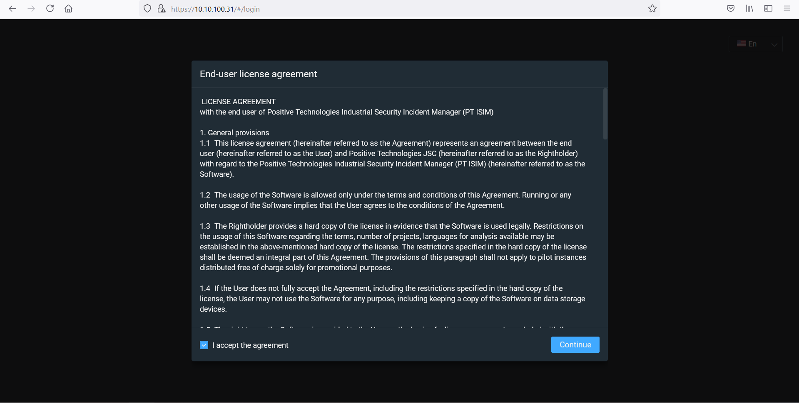
<h3>3. Веб-интерфейс</h3>

 Основные задачи по работе с PT ISIM netView Sensor вы можете выполнить в веб-
интерфейсе продукта. После входа в веб-интерфейс по умолчанию открывается страница
Статистика. Общими для всех страниц являются главное меню и панель инструментов.

Главное меню служит для переключения между основными страницами веб-интерфейса: 
— Статистика — содержит графики, отображающие статистику событий,
узлов, соединений, протоколов и инцидентов. 
— Узлы — позволяет просматривать обнаруженные в сети узлы в одном из
двух режимов: в виде таблицы или в виде графической схемы.  
— Инциденты — отображает инциденты, позволяет фильтровать их и изменять статус. Для
просмотра инцидентов доступны несколько режимов.  
— События — отображает события и временную шкалу. На временной
шкале синим цветом отмечены события, красным — атаки. 
Панель инструментов содержит следующие элементы управления: 
 -- позволяет просмотреть пользовательское соглашение, номер версии продукта, загрузить файл
лицензии; 
 -- параметры системы (позволяет сменить язык, провести диагностику служб, включить или
  выключить режим обучения, задать дисковое пространство и многое другое.) 
 -- позволяет сменить пароль и адрес электронной почты, подписаться на получение уведомлений об
инцидентах, а также завершить работу в продукте под текущей учетной записью; 
 -- позволяет просмотреть состояние сетевых интерфейсов

<h3>3.1 Смена языка</h3>
  
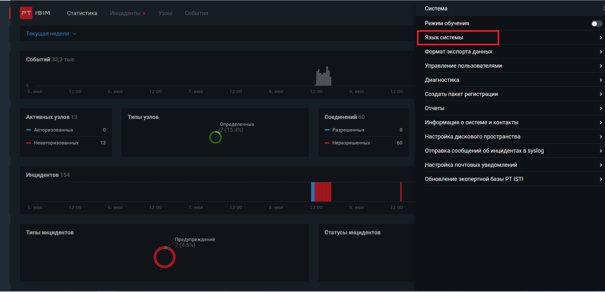  
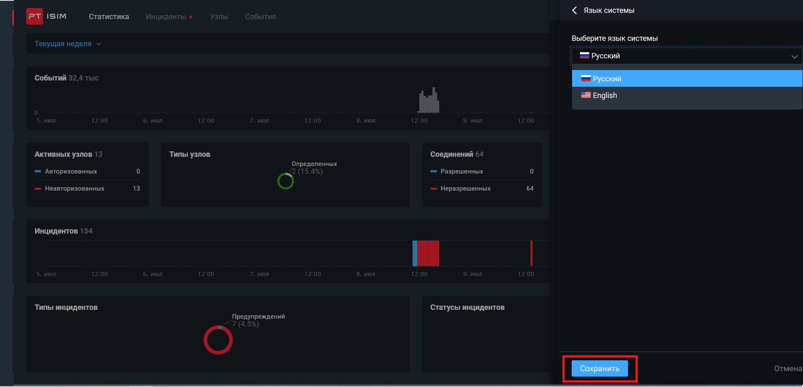 
<h3>3.2 Лицензия</h3>

Для работы PT ISIM netView Sensor необходимо активировать лицензию продукта.
Лицензирование PT ISIM netView Sensor основано на программных ключах, генерируемых с
помощью сервиса Sentinel EMS.
В PT ISIM netView Sensor предусмотрено два типа лицензий: 
— Платная лицензия для полноценного использования PT ISIM netView Sensor. Срок
действия платной лицензии устанавливается поставщиком продукта в зависимости от
условий поставки. 
— Пробная лицензия, предназначенная для демонстрационных целей и ограниченная
сроком действия на 90 дней. 
После истечения срока действия лицензии основные функции PT ISIM netView Sensor
(разбор трафика, заведение событий и инцидентов) остаются доступными, но
невозможным становится обновление продукта и обновление правил. 
Номер лицензионного ключа и срок действия лицензии вы можете проверить  по кнопке 
в веб-интерфейсе PT ISIM netView Sensor. 
<b style="color: #e31919;">Внимание!</b> Крайне не рекомендуется переводить системное время назад, так как в этом
случае механизм лицензирования может заблокировать основные функции продукта. 
<h4>Загрузка лицензии:</h4>
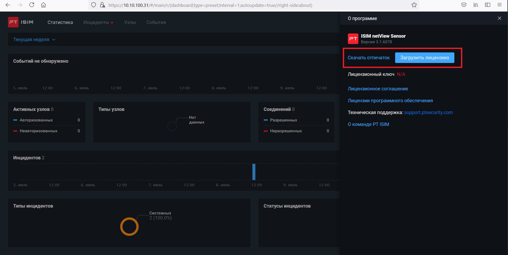

<h3>3.3 Статистика</h3>

Страница Статистика отображается при входе в веб-интерфейс PT ISIM netView Sensor и
состоит из следующих элементов: 
— временной шкалы с графиком количества событий за выбранный период; 
— графиков, показывающих количество активных узлов (на конец периода) и их
распределение по статусу авторизации и типу (на конец периода); 
— графика, показывающего количество разрешенных и неразрешенных соединений на
конец выбранного периода; 
— графика, показывающего количество используемых протоколов за выбранный период; 
— временной шкалы с графиком количества инцидентов за выбранный период (красным
цветом обозначается период, в котором есть хотя бы одна атака; желтым — период, в
котором нет атак, но есть хотя бы одно предупреждение; синим — период, в котором
есть только системные инциденты); 
— графиков, показывающих распределение инцидентов по типам и статусам (на конец
периода).  
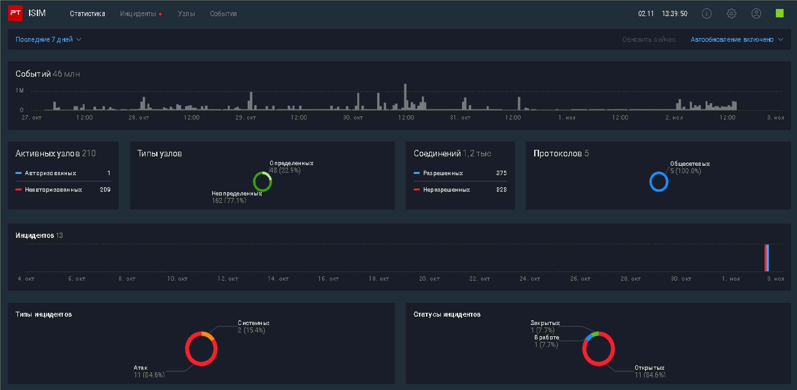
Также можно изменять период отображения данных. По умолчанию данные на странице Статистика отображаются за текущую неделю, то есть с 00:00 понедельника по текущий момент.
Вы можете изменить период отображения данных с помощью предустановленных
значений или введя интервал вручную.

<h3>3.4 Включение или выключение режима обучения</h3>

Когда PT ISIM netView Sensor обнаруживает в трафике ранее неизвестный MAC- или IP-
адрес, на странице <b>Инциденты</b> заводятся инциденты <b>"Неавторизованный узел"</b>, а на
странице <b>Узлы</b> появляется новый неавторизованный узел.
Все узлы, трафик которых начинает перехватываться сразу после установки продукта,
считаются неизвестными для PT ISIM netView Sensor. В число таких узлов входят узлы
промышленной сети, присутствие которых является нормальным и не должно считаться
инцидентом. Поэтому сразу после установки продукта включен режим обучения, то есть
режим работы PT ISIM netView Sensor, при котором все обнаруживаемые узлы и соединения
считаются доверенными, а инциденты об их появлении не заводятся. 
Как выключить режим обучения:  
1 способ - на странице Инциденты нажмите Выключить режим обучения. 
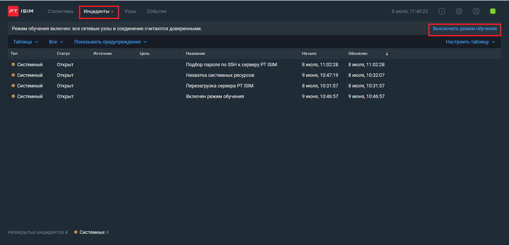 
2 способ - Заходим в параметры системы и выключаем режим обучения. 
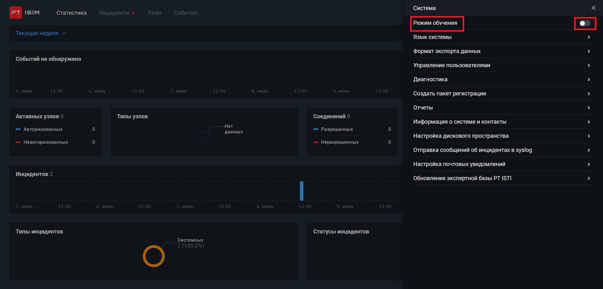

<h3>4. Работа с инцидентами</h3>
<h3>4.1 Об инцидентах</h3>

Инцидент — это событие или цепочка событий, результатом которых может стать
нарушение целостности, конфиденциальности или доступности элементов или ресурсов
анализируемой сети. 
Инцидент в PT ISIM netView Sensor имеет две временные метки: время начала и время
обновления. Время начала — это время, когда инцидент был зарегистрирован. Время
обновления — это время, когда в рамках этого же инцидента было зафиксировано
последнее событие. Если инцидент создан в результате одного события, то две временные
метки совпадают.

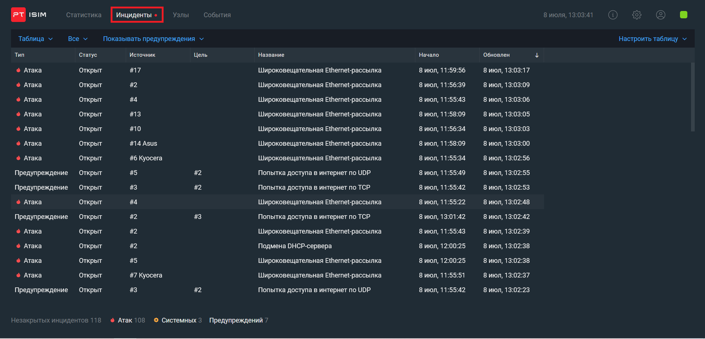

На скриншоте можем увидеть список инцидентов, тип, статус, источник, цель, название, начало и статус обновления инцидентов. 

Если нажать на инцидент, то откроется карточка инцидента для более подробного ознакомления.

<h3>4.2 Режимы просмотра инцидентов</h3>

Список инцидентов доступен на странице Инциденты. Просмотр инцидентов возможен в
следующих режимах: 
— Оперативный режим, который отображает только незакрытые инциденты и
предусмотрен для оценки текущего состояния анализируемой системы. В оперативном
режиме вы можете просматривать данные об инцидентах:
<ul>
<li>в виде сводки, которая позволяет оперативно оценить распределение текущих
инцидентов по узлам, например выявить узел, который в последнее время атакуют
больше всего, или инцидент, который возникает сразу на многих узлах (возможно,
эксплуатируется одна и та же уязвимость);</li>
<li>в виде таблицы, которая позволяет просматривать список наиболее актуальных
инцидентов, то есть инцидентов, в рамках которых в последнее время возникали
новые события.</li>
</ul>
— Режим "Все инциденты", который позволяет просматривать все инциденты в PT ISIM
netView Sensor и служит для поиска наиболее интересных инцидентов с помощью
фильтрации по параметрам. В этом режиме вы можете выгружать список инцидентов в
формате CSV и создавать отчеты по инцидентам.

Также можно настроить фильтрацию и скачать отчет инцидентов в csv формате.

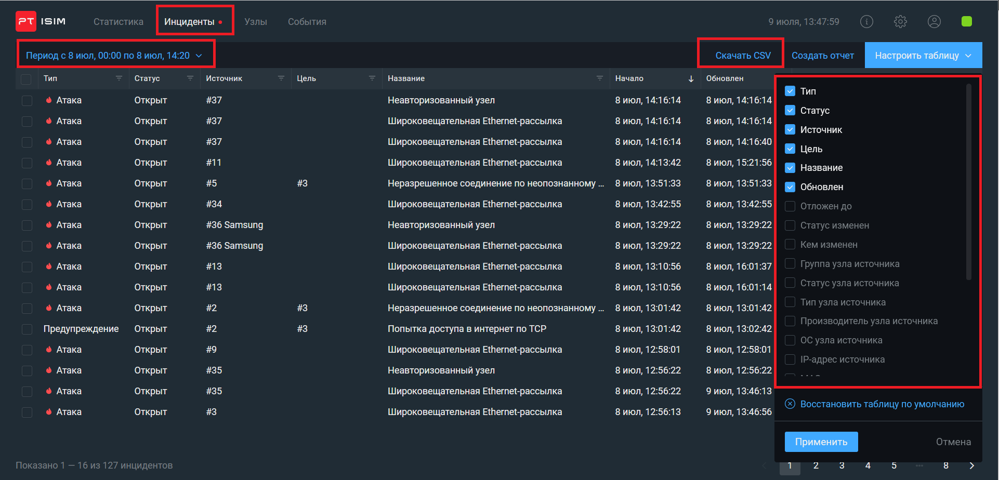
<h3>4.3 Изменение статуса инцидента</h3>

Каждый новый инцидент получает в PT ISIM netView Sensor статус "открыт". Чтобы
зафиксировать, что по инциденту ведется работа или что его последствия устранены, вы
можете изменять его статус. 
Изменение статуса инцидента доступно в режиме "Все инциденты" и в оперативном
режиме в таблице. Ниже приводится инструкция по изменению статуса инцидента в
режиме "Все инциденты". 
Чтобы изменить статус инцидента:
<ol>
<li>
В главном меню в разделе <b>Инциденты</b> выберите пункт <b>Все инциденты </b>
Откроется страница <b>Инциденты.</b>
</li>
<li>
Выберите инцидент в списке.
</li>
<li>
В панели справа отобразится карточка инцидента.
</li>
<li>
В раскрывающемся списке <b>Текущий статус</b> выберите статус.
</li>
</ol>
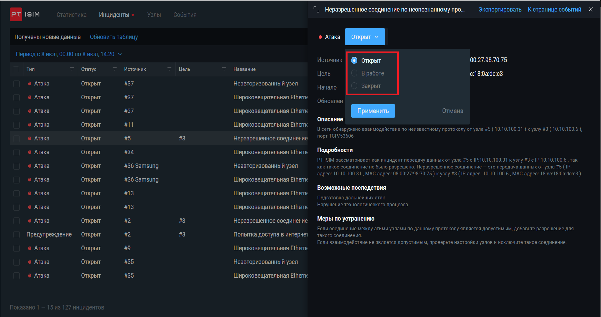

<h3>5. Работа с узлами</h3>
<h3>5.1 Об узлах</h3>

Узел — это элемент сети предприятия, взаимодействующий с другими элементами сети.
PT ISIM netView Sensor отображает следующие узлы: 
— узлы локальной сети (то есть узлы, IP-адреса которых попадают в диапазоны
192.168/16, 172.16/12 или 10/8), являющиеся источниками запросов или адресатами,
ответившими на запрос; 
— узлы внешней сети, являющиеся источниками запроса.

В веб-интерфейсе <b>Узлы</b> можно открыть в виде <b>Схемы</b> и в виде <b>таблицы</b>

<h4>Схема:</h4>

Схема
служит для оперативной работы с сетью: в этом режиме узлы и соединения отображаются
в графическом виде, но информация о них ограничена шестью часами. 
Схема отображает узлы, группы узлов и соединения в графическом виде. Вы можете
перемещать узлы и группы узлов на схеме, чтобы их расположение соответствовало
топологии вашей сети.

<h4>Таблица: </h4>
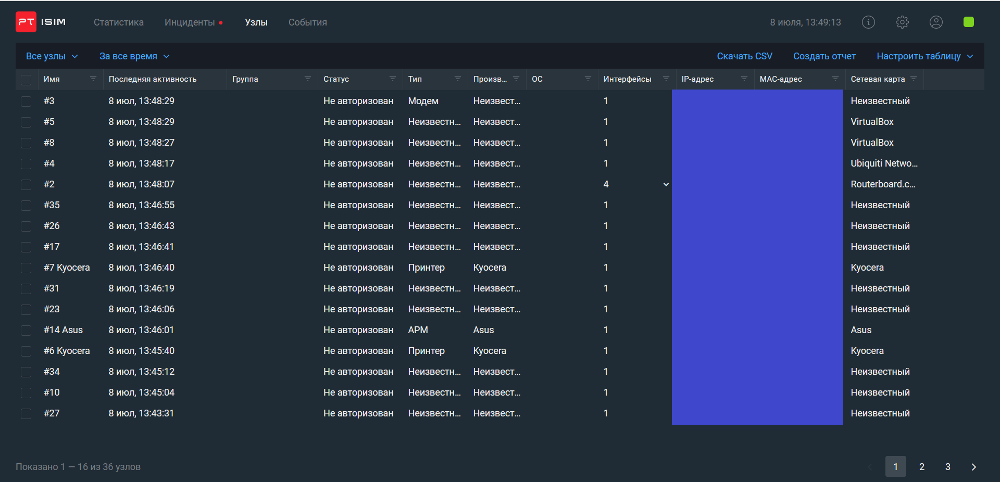

Таблица служит для
работы со всеми обнаруженными узлами, а также выполнения массовых действий: смены
статуса, типа или группы сразу нескольких узлов.
Параметры узлов и соединений обновляются в режиме реального времени на основе
данных, полученных из анализируемого трафика. 
Таблица показывает узлы с возможностью настроить отображение необходимых
параметров.

<h4>5.2 Изменение параметров узла</h4>

Чтобы изменить имя, тип или описание узла:
<ol>
<li>В главном меню в разделе <b>Узлы</b> выберите пункт <b>Схема</b></li>
<li>Выберите узел.</li>
<li>В открывшейся карточке узла нажмите кнопку <b>Изменить</b></li>
<li>Измените параметры узла -- имя, тип или описание.</li>
<li>Нажмите кнопку <b>Сохранить.</b></li>
</ol>

<h3>6. Работа с событиями</h3>
<h4>6.1 О событии</h4>

Событие — это обнаруженный PT ISIM netView Sensor факт передачи данных в сети.
PT ISIM netView Sensor регистрирует события и их атрибуты: дату и время обнаружения,
данные о протоколе взаимодействия, адреса источника и цели и другие. На основе
событий PT ISIM netView Sensor создает записи об инцидентах.

События отображаются на странице События в порядке их обнаружения от последних к
более ранним. По нажатию на событие в правой части страницы появляется карточка
события.

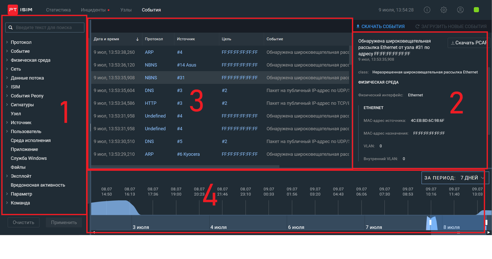

1 - Список фильтрации. С помощью фильтрации по атрибуту вы можете настраивать отображение только тех
событий, которые соответствуют определенному критерию, например имеют один и тот же
протокол или адрес источника. 
2 - Подробная информация о событии.  
3 - Список событий и основная информация. 
4 - События за выбранный период.

<h3>7. Отчеты</h3>

PT ISIM netView Sensor позволяет создавать и выгружать статистические отчеты.
Пользователи с ролью администратора могут просматривать, выгружать и удалять любые
отчеты, пользователи с ролью специалиста по безопасности и оператора могут
просматривать, выгружать и удалять только собственные отчеты.

<h4>7.1 Создание отчета</h4>

Чтобы создать отчет:  
<ol>
<li>
В панели инструментов нажмите  и в раскрывшемся меню выберите пункт <b>Отчеты</b>
</li>
<li>
Нажмите кнопку <b>Создать отчет</b> и в раскрывшемся меню выберите тип отчета.
</li>
<li>
Нажмите кнопку <b>Создать</b>
</li>
</ol>
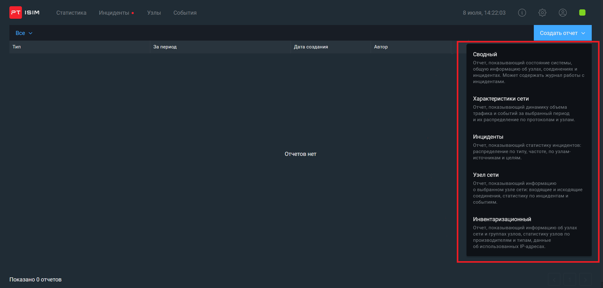  
  

<h3>8. Итог</h3>

В этом кратком обзоре мы узнали о таком продукте как PT ISIM netView Sensor, разобрали почему нужна защита сетей АСУ ТП и насколько это важно (даже на законодательном уровне),принцип работы, алгоритм обработки трафика, посмотрели на веб-интерфейс и основной функционал системы. В данной теме были затронуты самые важные и необходимые аспекты PT ISIM netView Sensor. На самом деле функционал намного больше и есть множества инструментов для обработки данных, а также выгрузки их для анализа.. Также есть PT ISIM Overview center - это командный центр, предназначенный для сбора информации с подключенных сенсоров, но об этом как-нибудь в другой раз))

